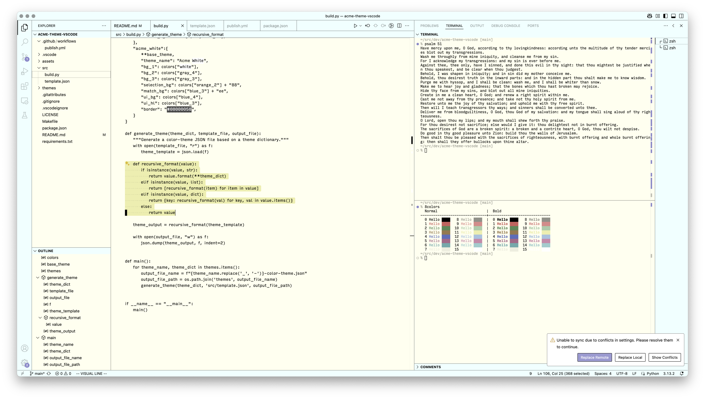

# Acme

VS Code theme inspired by the [Acme editor](https://en.wikipedia.org/wiki/Acme_%28text_editor%29). 

Two big differences between this theme and the original Acme editor's color scheme:

1. Comments are a faded foreground color.
2. Some other editor and/or UI colors are slightly muted, which looks better in VS Code on modern displays (IMHO).

A blue and white variant of the theme is also included (experimental).

## Screenshot



## Recommended Settings

```
{
    "explorer.decorations.colors": false,
    "workbench.editor.decorations.colors": false,
    "search.decorations.colors": false,
}
```

## Build

Requires vsce and Python ≥ 3.11.
- Build themes: `make build`
- Build extension: `make package`