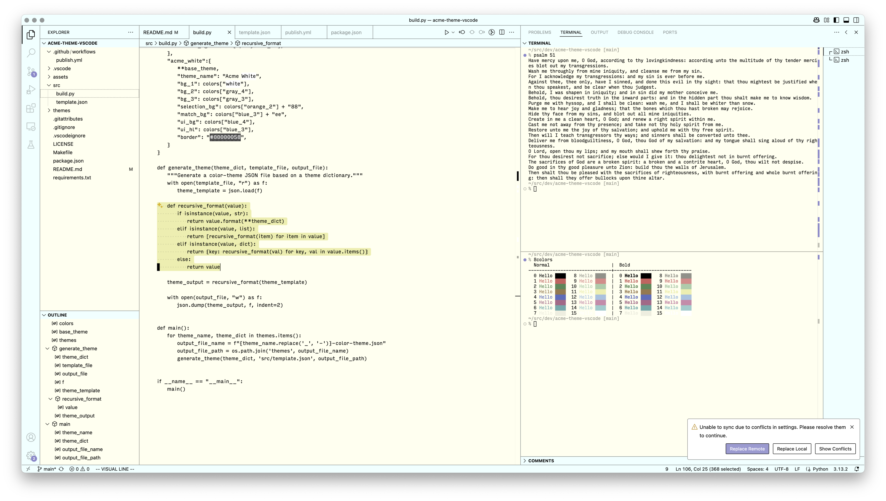

# Acme theme

A set of VS Code themes inspired by the [Acme editor](https://en.wikipedia.org/wiki/Acme_%28text_editor%29). 

Two big differences between the main theme and the original Acme editor's color scheme:

1. Comments are a faded foreground color.
2. A white-and-blue variant of the theme is included.

## Screenshot



## Recommended Settings

```
{
    "explorer.decorations.colors": false,
    "search.decorations.colors": false,
    "workbench.editor.decorations.colors": false,
    "workbench.shadows": false,
}

```

## Build

Requires awk and vsce.
- Build themes: `make build`
- Build extension: `make package`